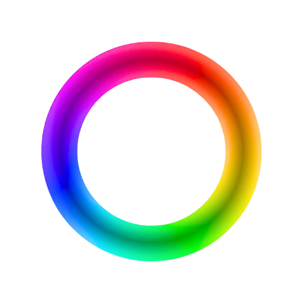
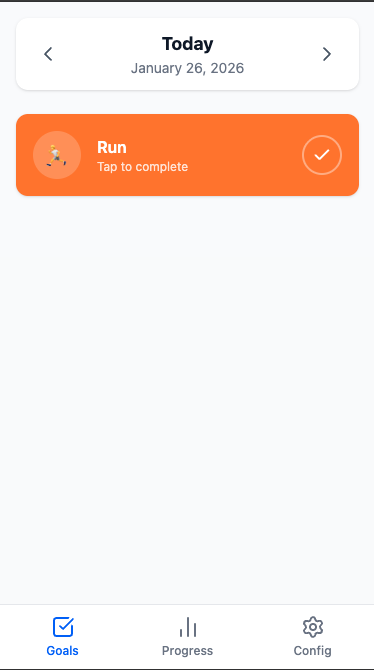
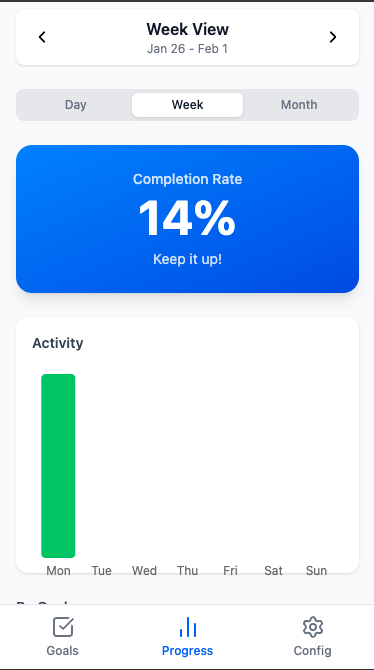
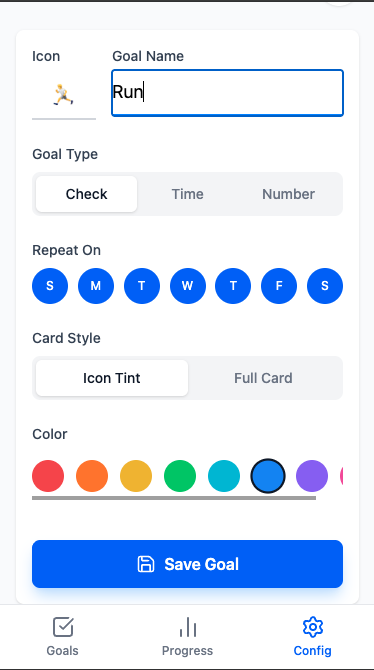

#  OAP - Objectives App

> [!CAUTION]
> **Warning: Under Construction** 🚧
> This project is currently in **beta stage**. Expect bugs, breaking changes, and evolving features.

[](https://astro.build)
[](https://reactjs.org)
[](https://tailwindcss.com)
[](https://web.dev/progressive-web-apps/)

**OAP** is a privacy-focused, offline-first personal activity organizer designed to help you build habits and achieve your daily goals without the clutter of traditional task managers.

> **Designed for all brains.** OAP provides a structured, predictable interface that works exceptionally well for neurodivergent individuals (ADHD, ASD, Anxiety) by reducing cognitive load and providing immediate visual feedback.

---

## ✨ Key Features

-   **🎯 Goal Tracking**: Create custom goals with different types:
    -   **Checkbox**: Simple yes/no completion.
    -   **Amount**: Track quantities (e.g., cups of water).
    -   **Time**: Track duration (e.g., minutes of reading).
-   **🔒 Privacy First**: Your data never leaves your device. No servers, no tracking, no cloud.
-   **📶 Offline Support**: A fully functional Progressive Web App (PWA) that works without an internet connection.
-   **📊 Visual Progress**: Insightful charts and completion rates to visualize your journey.
-   **⏰ Smart Reminders**: Built-in alarms to keep you on track with your routines.
-   **🌍 Multi-language**: Full support for English and Spanish.
-   **💾 Data Ownership**: Export your data to JSON or restore it from a backup anytime.

## 🚀 Tech Stack

-   **Framework**: [Astro](https://astro.build/) - High-performance content focus.
-   **UI Library**: [React](https://reactjs.org/) - For interactive components.
-   **State Management**: [Nanostores](https://github.com/nanostores/nanostores) - Tiny, persistent, and framework-agnostic.
-   **Styling**: [Tailwind CSS](https://tailwindcss.com/) - Modern utility-first CSS.
-   **Icons**: [Lucide React](https://lucide.dev/) - Clean and consistent iconography.
-   **Charts**: [Recharts](https://recharts.org/) - Customizable data visualization.
-   **PWA**: [Vite PWA Astro](https://vite-pwa-org.netlify.app/frameworks/astro.html) - Offline-first experience.

## 🛠️ Getting Started

### Prerequisites

-   [Node.js](https://nodejs.org/) (v18 or higher)
-   npm or yarn

### Installation

1.  Clone the repository:
    ```bash
    git clone https://github.com/your-username/oap.git
    cd oap
    ```

2.  Install dependencies:
    ```bash
    npm install
    ```

3.  Start the development server:
    ```bash
    npm run dev
    ```

4.  Build for production:
    ```bash
    npm run build
    ```

## 📸 Screenshots

| Daily Goals | Progress Tracking | Configuration |
| :---: | :---: | :---: |
|  |  |  |

---

## 🛡️ Privacy & Security

We believe your habits are personal. 
-   **No tracking**: No Google Analytics, no Cookies, no scripts that watch you.
-   **Local Storage**: All your data is stored in your browser's local storage/IndexedDB.
-   **Open Source**: Transparent code that anyone can audit.

## 📄 License

Licensed under GNU General Public License v3.0 (GPL-3.0).
Feel free to use it, modify it, and share it, but make it open source too. :)

---

Built with ❤️ by JaimeGH @ InledGroup
